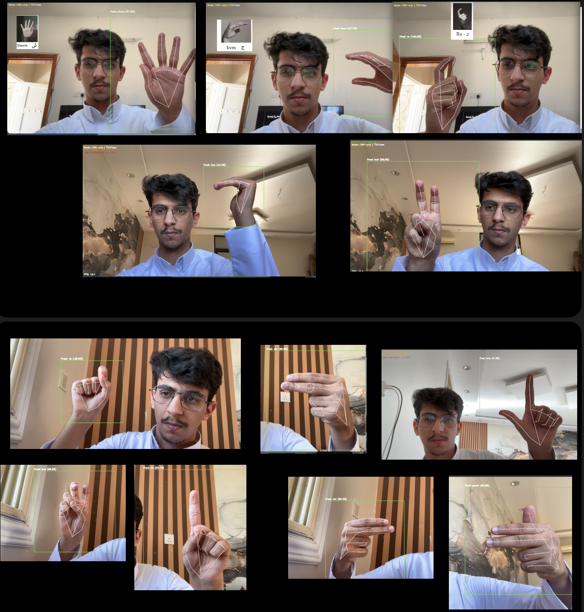

# 🤟 Real-Time Arabic Sign Language Recognition (CNN, Landmarks & Hybrid XGBoost)

End-to-end deep learning project for recognizing **Arabic Sign Language letters** in real time using **CNN**, **hand landmarks**, and a **hybrid model (CNN + Landmarks + XGBoost)**.  
This repository includes data preprocessing, model training, evaluation, and a real-time demo using the webcam.

---

## 🧠 Project Overview

This system leverages **Computer Vision** and **Deep Learning** techniques to identify Arabic sign language gestures from hand images.  
It aims to support communication accessibility for the **deaf and hard-of-hearing community**.

**Key Objectives:**
- Recognize Arabic sign language letters in real-time.  
- Compare CNN-based and hybrid deep learning models.  
- Provide an accessible demo for testing and research purposes.

---

## 🧩 Dataset

The dataset used in this project is **ASLAD-190K (Arabic Sign Language Alphabet Dataset)**, publicly available on Kaggle:

🔗 [ASLAD-190K on Kaggle](https://www.kaggle.com/datasets/boulesnane/aslad-190k-arabic-sign-language-alphabet-dataset/data?select=Number_of_images_per_Letter_ASLAD-190K.csv)

**Details:**
- **Total Images:** 190,000+ labeled images  
- **Classes:** 32 Arabic letters  
- **Structure:** Each class represents one Arabic alphabet gesture  
- **Landmarks:** Extracted using MediaPipe Hands for hybrid model  
- **Split:** 80% training / 10% validation / 10% testing  

> The dataset provides both raw RGB hand gesture images and CSV statistics describing image counts per class.

---

## ⚙️ Model Architectures

### 🧱 Model 1 — CNN
- **Base:** InceptionV3 (ImageNet pre-trained)  
- **Stage 1:** Frozen base layers, trained top FC layers  
- **Stage 2:** Fine-tuned last ~40 layers at low LR (1e-6)  
- Used for **real-time recognition** through webcam feed  

### 🔗 Model 2 — Hybrid (CNN + Landmarks + XGBoost)
- Extracted 2048-D CNN features from InceptionV3  
- Concatenated with 89-D hand landmarks → 2137-D feature vector  
- Classified with **XGBoost (multi:softprob)**  
- Achieved highest accuracy and stability  

---

## 📊 Results

| Model | Accuracy | Framework | Notes |
|--------|-----------|------------|-------|
| Landmarks MLP | 99.05% | TensorFlow / Keras | Using hand landmark coordinates only |
| InceptionV3 (frozen) | ~98% | TensorFlow | Stage 1 training |
| InceptionV3 (fine-tuned) | ~99% | TensorFlow | Stage 2 fine-tuning |
| Hybrid (CNN + Landmarks + XGBoost) | **99.94%** | TensorFlow + Scikit-learn | Slightly superior performance |

**ROC-AUC (Hybrid):**  
- Micro: **0.9999994**  
- Macro: **0.9999994**

---

## 🎥 Demo (Single Image)

Below is a snapshot collage from the **real-time recognition system**:

  

---

## 🛠️ Tech Stack

- **Python 3.10**  
- **TensorFlow / Keras**  
- **Scikit-learn**  
- **XGBoost**  
- **OpenCV**  
- **MediaPipe**  
- **NumPy / Pandas / Matplotlib**

---

## 🚀 Future Work

- Extend recognition from **letters → full words and sentences**.  
- Integrate **speech synthesis** for recognized text.  
- Deploy as a **web or mobile application** for accessibility.

---

## 📁 Repository Structure
Real-Time-Arabic-Sign-Language-Recognition/
│
├── 📁 src/
│   ├── model.ipynb                 # Notebook for model training, evaluation, and visualization
│   ├── live_asl_cam.py             # Real-time Arabic Sign Language recognition script
│
├── 📁 models/
│   ├── model.InceptionV3_stage1.keras
│   ├── model.InceptionV3_stage2.keras
│   ├── asl_landmarks.weights.h5
│   ├── xgb_cnn_plus_landmarks.json
│
├── 📁 assets/
│   ├── demo.png                    # Demo image showing real-time detection results
│   ├── الحروف مصوره.jpeg           # Reference image of Arabic sign letters
│
├── requirements.txt                # List of dependencies (TensorFlow, OpenCV, XGBoost, etc.)
├── .gitignore                      # Ignored files and directories
├── .python-version                 # Python version used
├── README.md                       # Project documentation
└── LICENSE                         # License (optional)

---

## 🧑‍💻 Author

**Rayan Saleh Al-Dwlah**  
🎓 Computer Science Student @ King Khalid University  
🔗 [LinkedIn](https://www.linkedin.com/in/rayan-saleh-b12a3132a/)  
🔗 [GitHub](https://github.com/RayanAlDwlah)

---

## 🏷️ License

This project is licensed under the **MIT License** — feel free to use it for research or educational purposes.